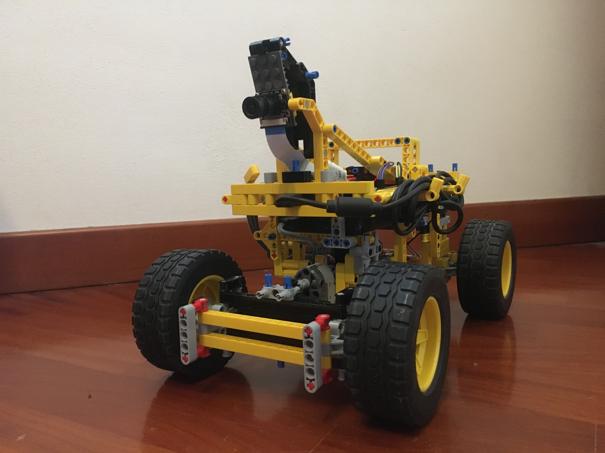
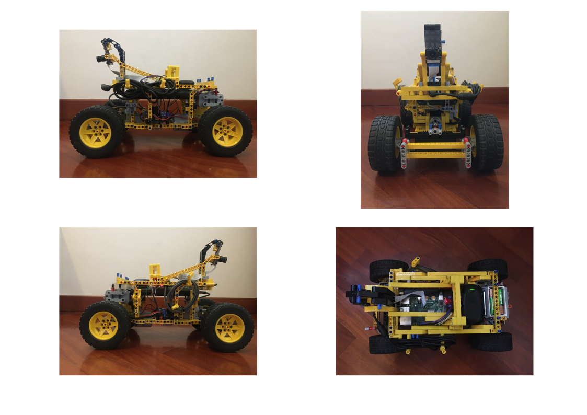
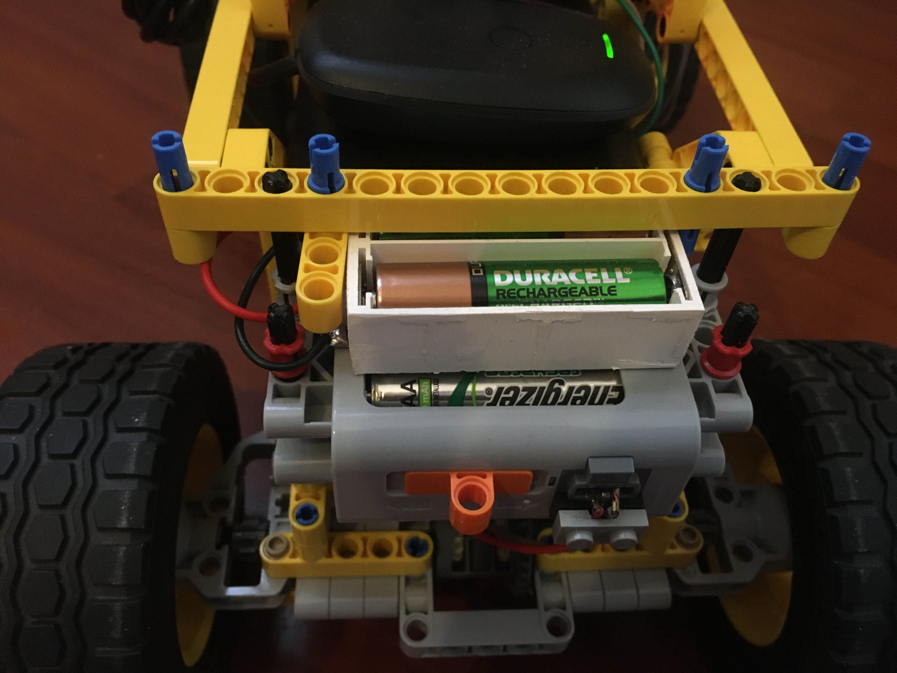
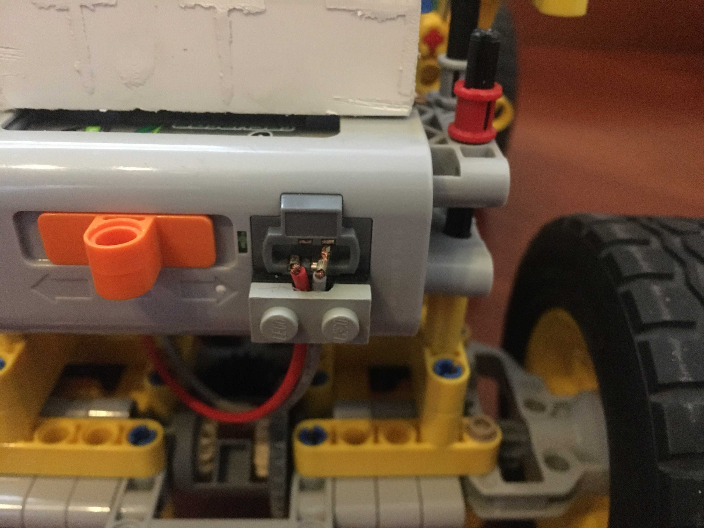
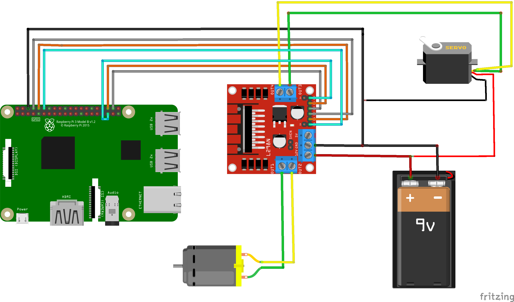
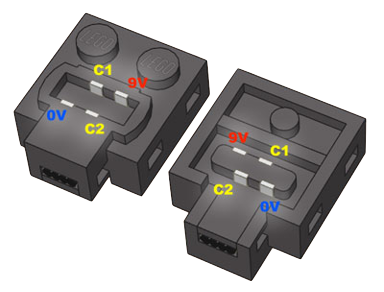
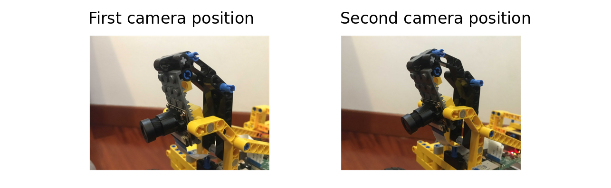
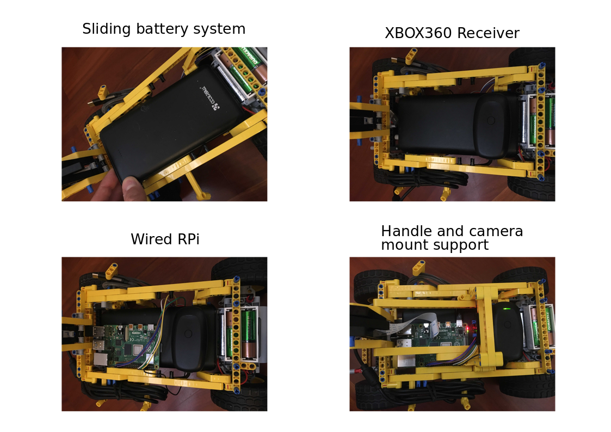

# **LegoCar Project**

Inspired by the Donkey Car project, I introduce the Lego Car project. The goal of the project is to design and develop an autonomous car build with elementary pieces of Lego and keeping everything else on a budget.

From the hardware side, the system is based on: **Raspberry Pi4b** for controlling the motors (steering / throttling) and running the perception algorithms  + **L298n** as motor driver + **Picamera** for perception + **Xbox360 Controller** used for manual control. 

The software development is based on the **ROS** framework, code has been written both in **C++** and **Python**. Driver/Controller libraries has been written for this specific hardware/configuration (feel free to ask if you need help with your specific configuration).

## **1 - Software Overview**

### **1.1 - Structure**

* [**l298n_drive**](l298n_drive): ROS package (C++) for interpreting /cmd_vel messages and converting it into actual motion.
* [**xb360_teleop_interface**](xb360_teleop_interface): ROS package (C++) for interpreting /joy messages and converting it into a /cmd_vel message.
* [**lane_detection**](lane_detection): ROS package (Python) running the perception algorithm. 

### **1.2 - Packages Dependencies**

The following project require the integration of existing ROS packages/libraries:
* [**WiringPi**](http://wiringpi.com/): ROS library (C) for RPi GPIO access
* [**raspicam_node**](https://github.com/UbiquityRobotics/raspicam_node): ROS package for image acquisition from Picamera, the image stream is published as a message of type Sensor_msgs/CompressedImage. 

## **2- Hardware Overview**

The Lego car model has been custom build for this specific project, it consist of a rear traction system (with differential steering), and a simple steering system in the front. A good starting point for a similar design is proposed here: [Fast and Compact LEGO PF RC car](https://www.youtube.com/watch?v=oS-6K2MqfjM). All the Lego pieces used in the construction were already available to me, almost all the parts comes from the 42030 Lego kit. The overall design of the car presented in this project is the result of multiple iterations. 

### **2.1 - Motors and Battery Pack**
A [Lego Power Function XL Motor](https://www.lego.com/it-it/product/lego-power-functions-xl-motor-8882) has been used for the traction system. For the steering system, a servo motor was needed in order to have precise control over the steering angle, I opted for a [Lego Power Function Servo Motor](https://www.lego.com/it-it/product/power-functions-servo-motor-88004), this specific motor has 15 fixed positions from +90° to -90°. 

Both motors are powered via the [Lego Battery Box](https://www.lego.com/it-it/product/lego-power-functions-battery-box-8881), that has been extended with two batteries in series for a total of 8, this in order to output the required voltage of 9V (Lego recommend 9V for this motors), also with rechargeable Ni-MH batteries (1.2V): 

This mod is not needed in case of non-rechargeable Ni-MH batteries (1.5V): 

In the long run the rechargeable solution is preferable due to the high demand of power (with the rechargeable solution I run the system for approx. 30 minutes before having a consistent decrease in maximum speed).

In order to connect all the components without rewiring all the cables, and therefore limiting the future use of the motor, I come up with a clamping system that consist of forcing the reinforced cable end into the desired pin and taking everything in place thanks to a modifies Lego flat 2x1.  

### **2.2 - Motors Driver**

A **L298n** module is used in order to control the XL function motor and the Servo one. The later has a control electronics slightly different from the classic 3 wires servo, it consist of 4 wires, one wire controls the servo in the clockwise direction (0..+90°) and the other along the anti-clockwise (0..-90°).

As a reference for the wiring and further technical information about Lego motors/servo: [Lego Technical Information](https://www.philohome.com/tech.htm). Below, the Lego connector scheme is shown:  

`OUT3` and `OUT4` of the l298n are wired respectively to `C1` and `C2` of the servo. The same applies to `OUT1` and `OUT2` for control ports of the XL motor. 

In a **DC motor (XL motor)** RPM (Revolutions-Per-Minute) can be module controlling the voltage. PWM (Pulse-Width-Modulation) signal can be used to control the voltage that goes through the motor. Varying the duty cycle of the PWM signal varies also the average voltage outputed (i.e. RPM of motor). 

With respect of the l298n functional scheme, `Input1` and `Input2` are used for controlling forward/backward direction instead the PWM signal is sent through the `EnableA` pin for the RPM control. Here is a summary table for the control of the XL motor:

|    Motion      | Input1 | Input2 | EnableA (PWM duty cycle %) |
|----------|-------------|-------------|------------------------------|
| Forward  | 1           | 0           | 0..100                       |
| Backward | 0           | 1           | 0..100                       |
| Brake    | 1           | 1           | 100                          |
| Float    | 0           | 0           | 0                            |

**Servo modules** exploits PWM signals for controlling the position of the axis. In a servo each fixed position of the axis correspond to a specific duty cycle, usually in a common servo system the control goes from -90° to +90° using just one wire. As previously said, in the Lego Servo motor we have 2 control wires, one for clockwise positions and the other for anti-clockwise, here the principle is well presented: [Controlling LEGO Power Functions Servo Motor](https://www.youtube.com/watch?v=XQskgJjk5S4).  

With respect of the l298n functional scheme, `Input3` and `Input4` are used for controlling clockwise/anticlockwise direction instead the PWM signal is sent through the `EnableB` pin for the position control. Here is a summary table for the control of the Servo motor:

| Position   | Input3 | Input4 | EnableB (PWM duty cycle %) |
|------------|-------------|-------------|------------------------------|
| 7 (90°)    | 0           | 1           | 100                          |
| 6          | 0           | 1           | 88.2                         |
| 5          | 0           | 1           | 76.0                         |
| 4          | 0           | 1           | 63.5                         |
| 3          | 0           | 1           | 50.1                         |
| 2          | 0           | 1           | 38.0                         |
| 1          | 0           | 1           | 25.8                         |
| 0 (0°)     | 0           | 0           | 0                            |
| -1         | 1           | 0           | 25.8                         |
| -2         | 1           | 0           | 38.0                         |
| -3         | 1           | 0           | 50.1                         |
| -4         | 1           | 0           | 63.5                         |
| -5         | 1           | 0           | 76.0                         |
| -6         | 1           | 0           | 88.2                         |
| -7 (-90°)  | 1           | 0           | 100                          |

**Raspberry Pi4** has 4 IO that can output hardware PWM signals (as reference see: [Raspberry Pi GPIO](https://www.raspberrypi.org/documentation/usage/gpio/)). In this project I have used (in BCM notation) GPIO19 and GPIO18 as output PWM channels, GPIO14, GPIO15, GPIO16, GPIO20 as standard output channels.  

### **2.3 - PiCamera**

The camera used was already available to me (reused from another project), it has a 75° vision angle, with IR features ([Camera Link](https://it.banggood.com/Camera-Module-For-Raspberry-Pi-4-Model-B-or-3-Model-B-or-2B-or-B+-or-A+-p-1051437.html?rmmds=buy&cur_warehouse=UK)). In the donkey car project they are using a wide angle lens (120/150° angle) in order to get a better vision around the car, this can be useful in order to have more information about the environment in one pic, but also can 'distract' the perception algorithm with useless informations. We will discuss further this aspect in the perception algorithm repo.

The camera, has been fixed using little screws onto a planar lego piece, that is part of a adjustable inclination mount.

### **2.4 - RPi and Xbox Controller**

The Raspberry Pi is powered by a second battery that outputs 5V/3A as requested by the RPi. The battery serves also as mounting support for the RPi and the controller receiver.

In the images above the is shown the sliding system of the battery, this guarantee an easy access to the electronics below when needed. The Xbox360 receiver is fixed in place using patafix. An handle has been designed in order easily transport the car manually.

