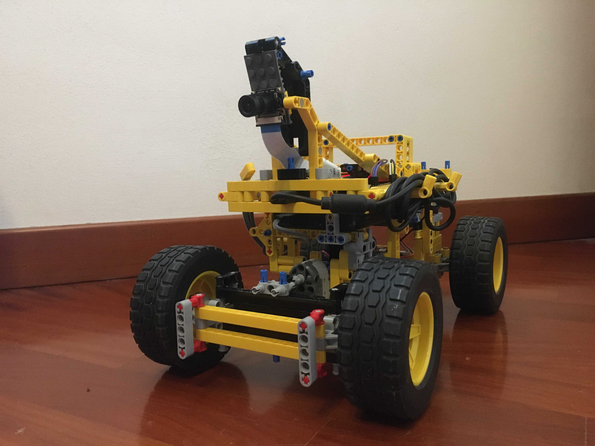
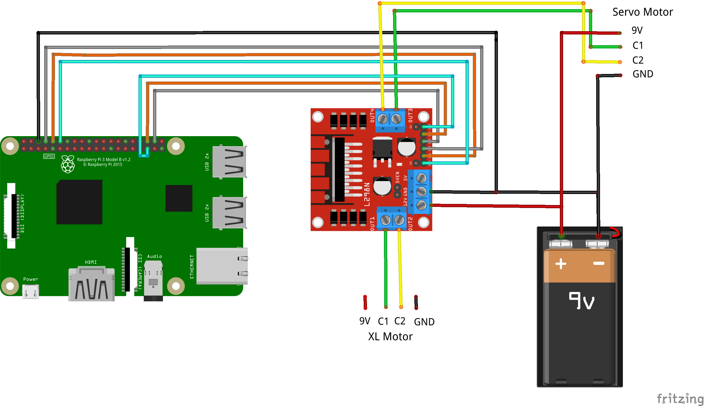
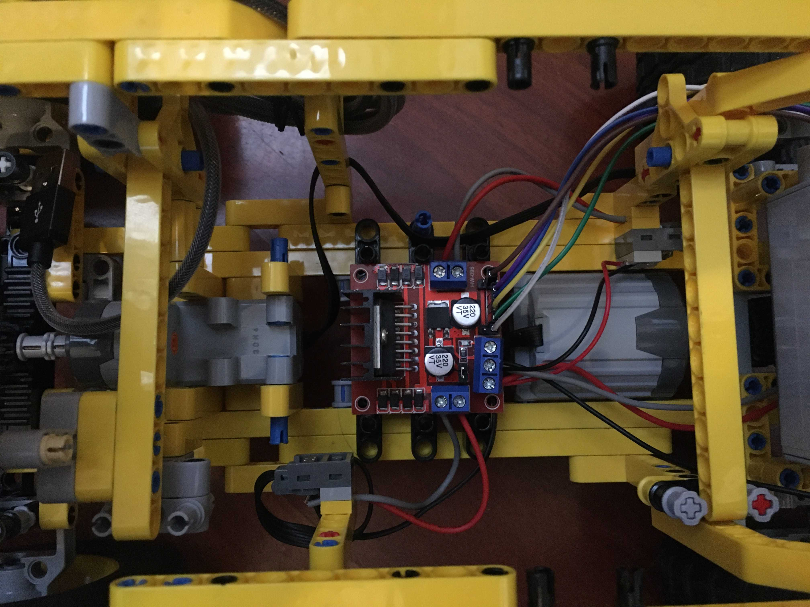

# **LegoCar Project**

Inspired by the Donkey Car project, I introduce the Lego Car project. The goal of the project is to design and develop an autonomous car build with elementary pieces of Lego and keeping everything else on a budget.

From the hardware side, the system is based on: **Raspberry Pi4b** for controlling the motors (steering / throttling) and running the perception algorithms  + **L298n** as motor driver + **Picamera** for perception + **Xbox360 Controller** used for manual control. 

The software development is based on the **ROS** framework, code has been writen both in **C++** and **Python**. Driver/Controller libraries has been writen for this specific hardware/configuration (feel free to ask if you need help with your specific configuration).

## **1- Hardware Overview**

The Lego car model has been custom build for this specific project, it consist of a rear traction system (with differential steering), and a simple stearing system in the front. A good starting point for a similar design is proposed here: [Fast and Compact LEGO PF RC car](https://www.youtube.com/watch?v=oS-6K2MqfjM). All the Lego pieces used in the construction were already available to me, almost all the parts comes from the 42030 Lego kit. The overall design of the car presented in this project is the result of multiple iterations. 

### **1.1 - Motors and Battery Pack**
A [Lego Power Function XL Motor](https://www.lego.com/it-it/product/lego-power-functions-xl-motor-8882) has been used for the traction system. For the stearing system, a servo motor was needed in order to have precise control over the stearing angle, I opted for a [Lego Power Function Servo Motor](https://www.lego.com/it-it/product/power-functions-servo-motor-88004), this specific motor has 15 fixed positions from +90° to -90°. 

Both motors are powered via the [Lego Battery Box](https://www.lego.com/it-it/product/lego-power-functions-battery-box-8881), that has been extended with two batteries in series for a total of 8, this in order to output the required voltage of 9V (Lego recommend 9V for this motors), also with rechargeable Ni-MH batteries (1.2V) 
$$ V_{battery box} = 8 * 1.2V = 9.6V$$

This mod is not needed in case of non-rechargeable Ni-MH batteries (1.5V): 
$$ V_{battery box} = 6 * 1.5V = 9V$$

In the long run the rechargable solution is preferable due to the high demand of power (with the rechargeable solution I run the system for approx. 30 minutes before having a consisten decrease in maximum speed).

In order to connect all the components without rewiring all the cables, and therefore limiting the future use of the motor, I come up with a clamping system that consist of forcing the reinforced cable end into the desired pin and taking everything in place thanks to a modifies lego flat 2x1.  

### **1.2 - Motors Driver**

An L298n module is used in order to control the XL function motor and the servo one. In the schematics the DC motor represents the Lego XL function motor and the common servo the Lego servo. The later has a control electronics slightly different from the classic 3 wires servo, it has infact 4 wires, the difference is that it uses one wire for controlling the servo in the clockwise direction (0..+90°) and the other along the anti-clockwised (0..-90°).

As a reference for the wiring and further technical information about Lego motors/servo: [Lego Technical Information](https://www.philohome.com/tech.htm). Below, the Lego connector scheme is shown:  

Refering to the project schematic, `out3` and `out4` of the l298n are wired respectivelly to `C1` and `C2` of the servo. The same applies to `out1` and `out2` for control ports of the XL motor. 

