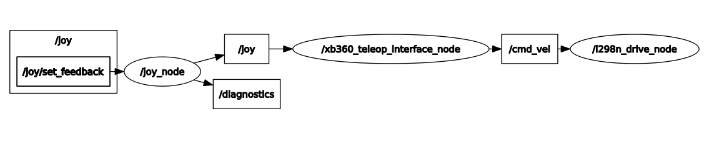

# **L298n Driver Library**

The package provide a basic l298n driver library for converting geometry_msgs/Twist messages into Legocar movements.

## **1 - Main dependencies**

* geometry_msgs/Twist
* wiringPi
* ros/ros

## **2 - Functionalities**

The package subscribe to the topic `/cmd_vel` (type geometry_msgs/Twist), published by [xb360_teleop_interface](../xb360_teleop_interface). It gives direct access to the GPIO of the RPi and controls the output ports, wired to the l298n module.



This library exploit [WiringPi](http://wiringpi.com/) to get access to the GPIO ports, in particular for the ports that require a PWM, administrator permission is required, for this reason in the launch file of the Legocar we have:

````xml 
<node pkg="l298n_drive" name="l298n_drive_node" type="l298n_drive" output="screen" launch-prefix="sudo -E LD_LIBRARY_PATH=$(optenv LD_LIBRARY_PATH)"> </node>

````

Prefix consist of `sudo -E` for running the node with administrator privileges, preserving the environment when running the command (WITH some exception, variables like PATH, LD_LIBRARY_PATH, ecc. are not preserved).  Moreover we need to specify the library path `LD_LIBRARY_PATH`, that is not preserved in as environment variable. 

Refer to the following table for the linear motor control:

|    Motion      | In1 | In2 | EnA (PWM duty cycle %) |
|----------|-------------|-------------|------------------------------|
| Forward  | 1           | 0           | 0..100                       |
| Backward | 0           | 1           | 0..100                       |
| Brake    | 1           | 1           | 100                          |
| Float    | 0           | 0           | 0                            |

