# **Line Detection**

 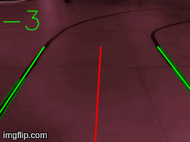
 
The package provide lane detection functionalities for the compressed image coming from the `raspicam_node`. A direction angle is computed and outputted with the topic `/steering_angle`.
The Implementation presented is based on several filters applied to the image, and the subsequent application of Canny algorithm + Hought transform. 

## **1 - Main dependencies**
 
* sensor_msgs/CameraInfo
* sensor_msgs/CompressedImage
* rospy
* numpy
* opencv (cv2)
* line_detect/steering_angle

## **2 - Functionalities**

The package subscribe to the topic `/raspicam_node/image/compressed` (type sensor_msgs/CompressedImage), published by the raspicam_node package. Messages are published on topic `/steering_angle`, a custom message designed for passing direction information to the PD controller.

The acquired image go through a specific pipeline in order to extract the the lane/s from the scene. Lanes are then implied in the computation of a direction vector for the LegoCar.

The pipeline of the image analysis process is:

 1. **Image acquisition and undistortion process**
 2. **Filtering image (blacks)**
 3. **Edge detection wt Canny algorithm**
 4. **ROI + Lines detection wt Hough transform**
 5. **Averaging of detected lines based on slope**
 6. **Computation of middle line**
 
 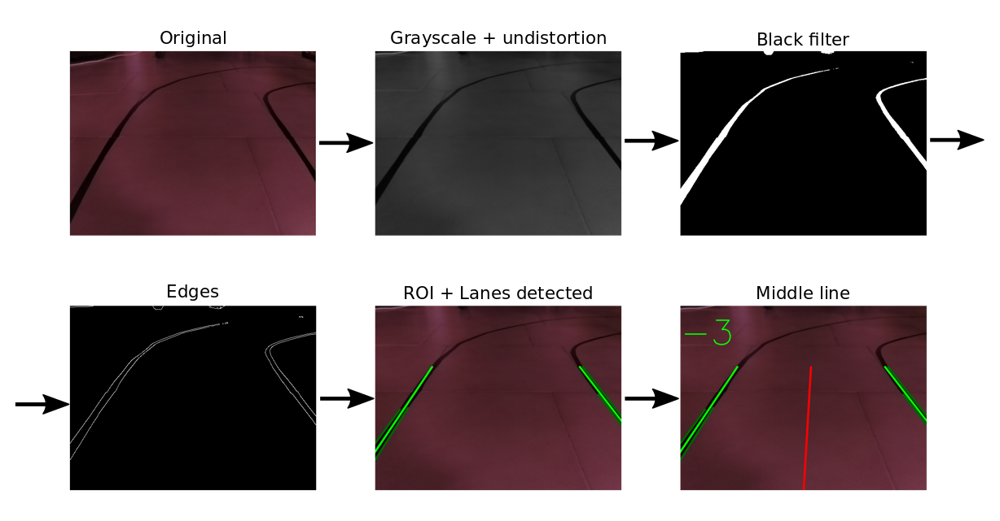

### **2.1 - Image acquisition and undistortion process** 
 
Cameras transform 3D space information into a 2D form. Since this process is not perfect (due to the imperfect production process of the lenses), we cannot trust the information coming straight from the camera as it is. Our goal is to position the car in space, in order to do it properly the camera matrix and the distortion coefficient needs to be computed and both compensated.
 
The `raspicam_node` package contains a calibration tool, called [`camera_calibration`](https://github.com/UbiquityRobotics/raspicam_node), a calibration maze is needed for this process. Once the process is completed a `.yaml` file is generated. Follows an example:

````
image_width: 640
image_height: 480
camera_name: camerav2_640x480
camera_matrix:
  rows: 3
  cols: 3
  data: [724.7065317897147, 0, 329.1544084760975, 0, 723.9111589306867, 222.2659871640654, 0, 0, 1]
distortion_model: plumb_bob
distortion_coefficients:
  rows: 1
  cols: 5
  data: [-0.425024653765871, 0.2275022820178016, -0.0009324566898835676, 0.002125165132523941, 0]
rectification_matrix:
  rows: 3
  cols: 3
  data: [1, 0, 0, 0, 1, 0, 0, 0, 1]
projection_matrix:
  rows: 3
  cols: 4
  data: [661.0226440429688, 0, 332.2321572900546, 0, 0, 688.1121215820312, 220.1584891049697, 0, 0, 0, 1, 0]
````

From this file we are going to extract `camera_matrix` and `distortion_coefficient`. Th function `undistort` (in the `callback` function) from the `OpenCV` library, will then rectify the original image. Below an example of the process where an horizontal line has been added as a reference, looking closely we can notice how the floor joints in the original image has a parabolic trend, instead in the rectified one they are perfectly straight.  

 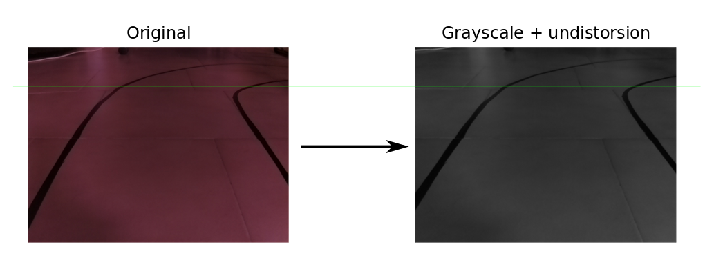
 
Before proceeding a `COLOR_BGR2GRAY` color conversion has been applied in order to decrease the number of color channels and concurrently the computational weight for each image. 

Here a sample of the output of this step:

 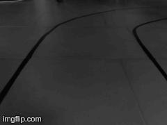


### **2.2 - Filtering image (blacks)**

In order to increase the precision of the perception algorithm a further filtering of the image is required. This has been accessed after the first tests of the algorithm where the floor joints where detected as reference lanes, compromising the result. The solution was to filter out every pixel above a certain range of the gray scale.

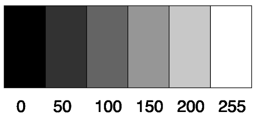

We are going to create a mask with all the pixels below `50` in the grayscale, an optimal value for filtering out just the floor joints. This filter method has some dependents on the light conditions. In order to have consistent light conditions, all the tests has been carried in-house, with no interference from the sun light (artificial light constant). The output mask represent in white the black pixels of the source image. 

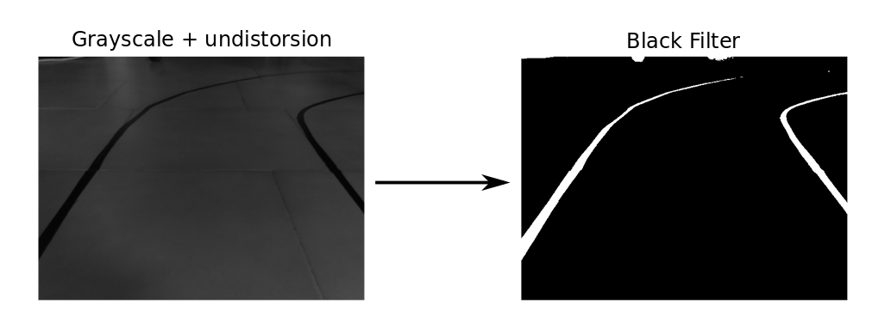

Here a sample of the output of this step:

 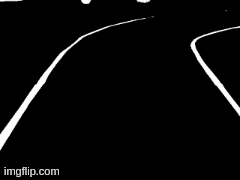
 
### **2.3 - Edge detection wt Canny algorithm**

The next step consist in applying the Canny algorithm for performing edge detection. The Canny algorithm consist of different steps, processed internally from the function `Canny`:

 1. **Noise Reduction**: The image is blurred thanks to a Gaussian filter (5x5), this aims to reduce pixel level noise.
 2. **Intensity Gradient**: A Sobel kernel is applied to the entire image both vertically and secondly horizontally resulting in two gradients matrix $G_x$ and $G_y$. 
 
 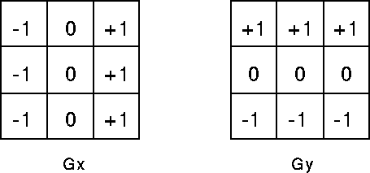
 
 The Sobel kernel extract any vertical or horizontal edge depending on the kernel adopted.
 
 Both gradients are then combined to obtain $G$ the $Edge Gradient = \sqrt{G_x^2 + G_y^2}$. The direction of the gradient is given by: 
 
$$tan^{-1} \left( \dfrac{G_x}{G_y}\right)$$

3. **Non-Maximum Suppression**: This step is required in order to have a one pixel edge instead of considering redundant pixels signaling the same edge.

4. **Hysteresis Thresholding**: Last step of the algorithm consist in selecting which edge we want to take and which discard. The threshold value consist of the gradient intensity, any edge below a certain minimum value is discarded instead any edge above a maximum value is taken. Anything in between this two limits are kept if they are connected to a over-max edge.

 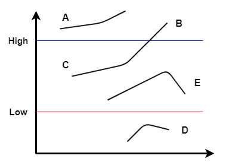 
 
 Considering the picture above, **A**, **B/C** are going to be taken as edges, instead E and D discarded.
 
The `Canny` function implemented in OpenCV requires only (in addition to the image to process) the Max and Min threshold. The ones used in the project derive form a initial tests where the car has been placed in ideal conditions.

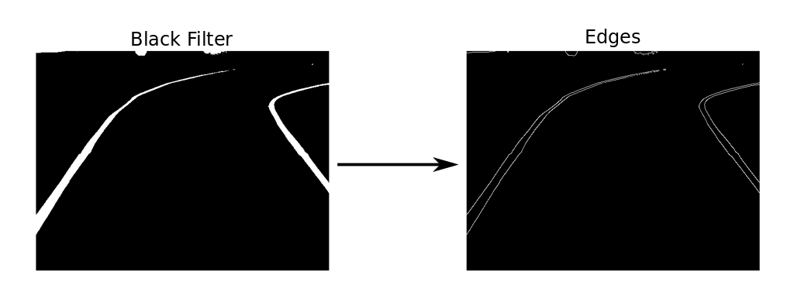

Here a sample of the output of this step:

 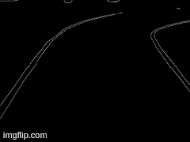
 
###  **2.4 ROI + Lines detection wt Hough transform**

Next step in the pipeline consist in selecting a ROI (Region Of Interest), this helps the system eliminate noise information from the image (surroundings and long distance lanes), keeping only the relevant part. The shape of the ROI is shown in the image below (red rectangle), the height of the rectangle is the 66% of the total height of the image.

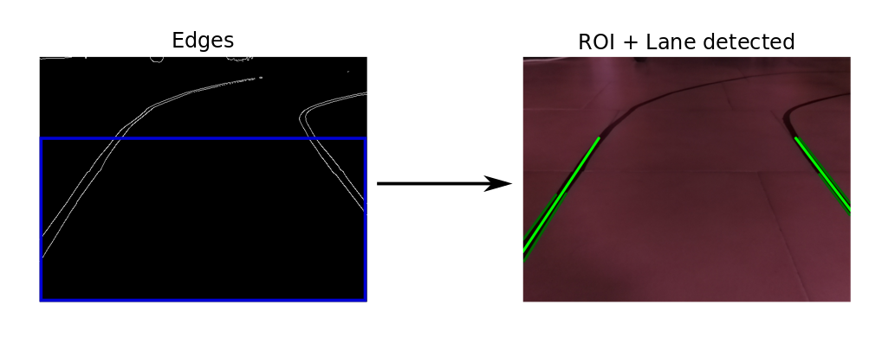

The image has been processed enough, and not we are in the ideal situation to perform the actual lane detection. In order to do that we are going to use the Hough transform, an algorithm specifically developed for identifying lines in an image. 

 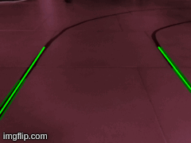


