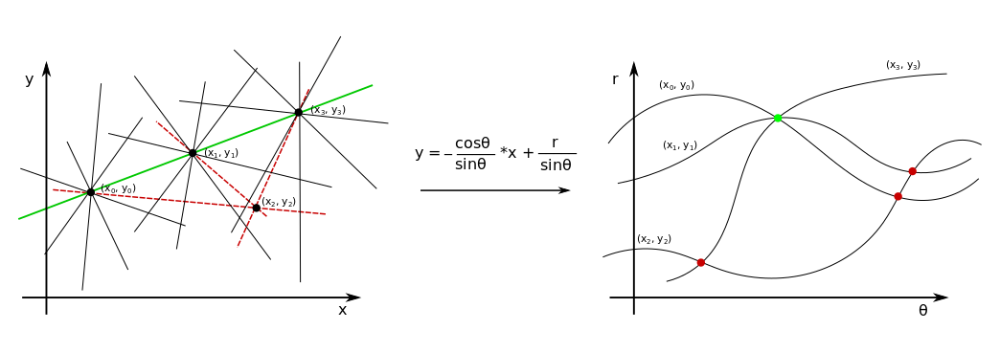
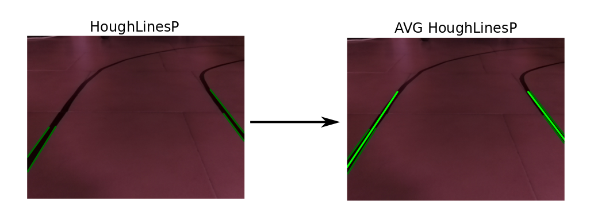
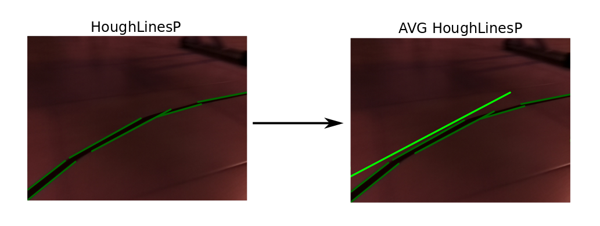
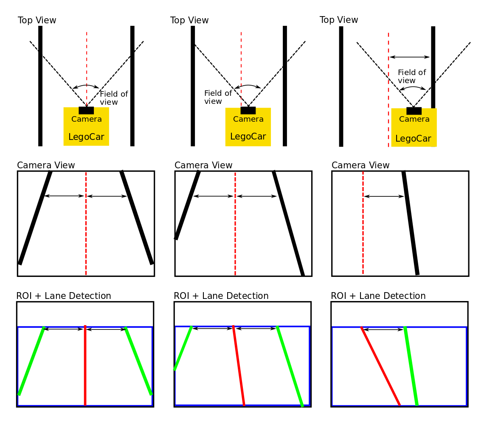
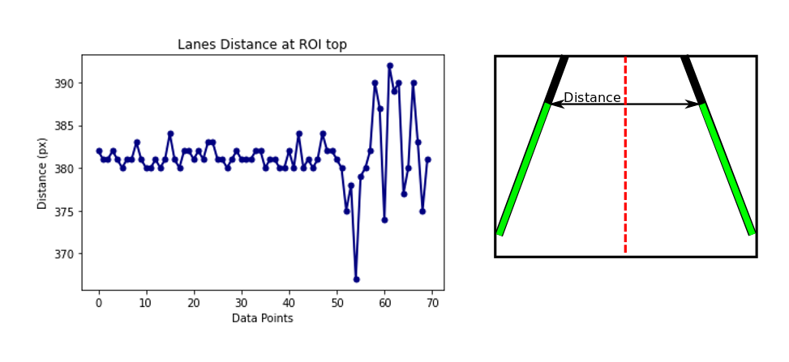
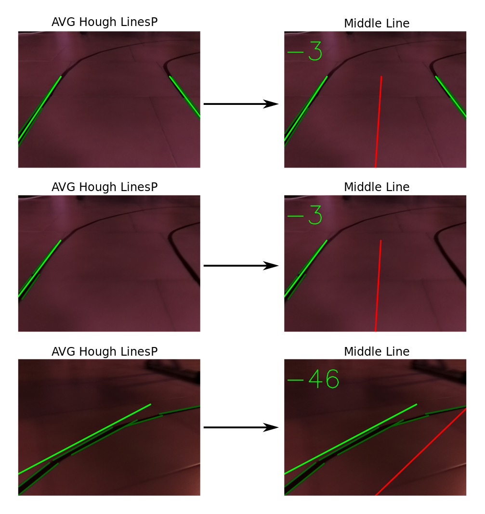

# **Lane Detection**

[](https://www.youtube.com/watch?v=NI2pKg-ZRkI)

**^^^ Click for opening the video**
 
The package provide lane detection functionalities for the compressed image coming from the `raspicam_node`. A direction angle is computed and outputted with the topic `/steering_angle`. A processed image is published to the `/lane_detection/image/compressed` topic.
The Implementation presented is based on several filters applied to the image, and the subsequent application of Canny algorithm + Hought transform. 

## **1 - Main dependencies**
 
* sensor_msgs/CameraInfo
* sensor_msgs/CompressedImage
* rospy
* numpy
* opencv (cv2)
* line_detect/steering_angle

## **2 - Functionalities**

The package subscribe to the topic `/raspicam_node/image/compressed` (type sensor_msgs/CompressedImage), published by the raspicam_node package. Messages are published on topic `/steering_angle`, a custom message designed for passing direction information to the PD controller.

The acquired image go through a specific pipeline in order to extract the the lane/s from the scene. Lanes are then implied in the computation of a direction vector for the LegoCar. The output of the pipeline process is then published to the `/lane_detection/image/compressed` topic.

The pipeline of the image analysis process is:

 1. **Image acquisition and undistortion process**
 2. **Filtering image (blacks)**
 3. **Edge detection wt Canny algorithm**
 4. **ROI + Lines detection wt Hough transform**
 5. **Computation of middle line**
 
 

### **2.1 - Image acquisition and undistortion process** 

 
 
Cameras transform 3D space information into a 2D form. Since this process is not perfect (due to the imperfect production process of the lenses), we cannot trust the information coming straight from the camera as it is. Our goal is to position the car in space, in order to do it properly the camera matrix and the distortion coefficient needs to be computed and both compensated.
 
The `raspicam_node` package contains a calibration tool, called [`camera_calibration`](https://github.com/UbiquityRobotics/raspicam_node), a calibration maze is needed for this process. Once the process is completed a `.yaml` file is generated. Follows an example:

````
image_width: 640
image_height: 480
camera_name: camerav2_640x480
camera_matrix:
  rows: 3
  cols: 3
  data: [724.7065317897147, 0, 329.1544084760975, 0, 723.9111589306867, 222.2659871640654, 0, 0, 1]
distortion_model: plumb_bob
distortion_coefficients:
  rows: 1
  cols: 5
  data: [-0.425024653765871, 0.2275022820178016, -0.0009324566898835676, 0.002125165132523941, 0]
rectification_matrix:
  rows: 3
  cols: 3
  data: [1, 0, 0, 0, 1, 0, 0, 0, 1]
projection_matrix:
  rows: 3
  cols: 4
  data: [661.0226440429688, 0, 332.2321572900546, 0, 0, 688.1121215820312, 220.1584891049697, 0, 0, 0, 1, 0]
````

From this file we are going to extract `camera_matrix` and `distortion_coefficient`. Th function `undistort` (in the `callback` function) from the `OpenCV` library, will then rectify the original image. Below an example of the process where an horizontal line has been added as a reference, looking closely we can notice how the floor joints in the original image has a parabolic trend, instead in the rectified one they are perfectly straight.  

 
 
Before proceeding a `COLOR_BGR2GRAY` color conversion has been applied in order to decrease the number of color channels and concurrently the computational weight for each image. 

### **2.2 - Filtering image (blacks)**


In order to increase the precision of the perception algorithm a further filtering of the image is required. This has been accessed after the first tests of the algorithm where the floor joints where detected as reference lanes, compromising the result. The solution was to filter out every pixel above a certain range of the gray scale.


We are going to create a mask with all the pixels below `50` in the grayscale, an optimal value for filtering out just the floor joints. This filter method has some dependents on the light conditions. In order to have consistent light conditions, all the tests has been carried in-house, with no interference from the sun light (artificial light constant). The output mask represent in white the black pixels of the source image. 


 
### **2.3 - Edge detection wt Canny algorithm**

 

The next step consist in applying the Canny algorithm for performing edge detection. The Canny algorithm consist of different steps, processed internally from the function `Canny`:

 1. **Noise Reduction**: The image is blurred thanks to a Gaussian filter (5x5), this aims to reduce pixel level noise.
 2. **Intensity Gradient**: A Sobel kernel is applied to the entire image both vertically and secondly horizontally resulting in two gradients matrix <em>Gx</em> and <em>Gy</em>. 
 
      
 
    The Sobel kernel extract any vertical or horizontal edge depending on the kernel adopted.
 
     Both gradients are then combined to obtain the <em>Edge Gradient = </em>
 
     .
 
     The direction of the gradient is given by <em>Angle = </em> 

     

3. **Non-Maximum Suppression**: This step is required in order to have a one pixel edge instead of considering redundant pixels signaling the same edge.

4. **Hysteresis Thresholding**: Last step of the algorithm consist in selecting which edge we want to take and which discard. The threshold value consist of the gradient intensity, any edge below a certain minimum value is discarded instead any edge above a maximum value is taken. Anything in between this two limits are kept if they are connected to a over-max edge.

      
 
     Considering the picture above, **A**, **B/C** are going to be taken as edges, instead E and D discarded.
 
The `Canny` function implemented in OpenCV requires only (in addition to the image to process) the Max and Min threshold. The ones used in the project derive form a initial tests where the car has been placed in ideal conditions.


 

###  **2.4 - ROI + Lines detection wt Hough transform**

 

Next step in the pipeline consist in selecting a ROI (Region Of Interest), this helps the system eliminate noise information from the image (surroundings and long distance lanes), keeping only the relevant part. The shape of the ROI is shown in the image below (blue rectangle), the height of the rectangle is the 66% of the total height of the image.


The image is now in the ideal situation to perform the actual lane detection. In order to do that we are going to use the Hough transform, an algorithm specifically developed for identifying straight lines. 

The algorithm consist in analyzing each pixel of the image and identifying if the specific pixel is part of a straight line. In order to do that, all the lines that goes through a specific pixel are considered, confronting all the lines from all the points, the algorithm extrapolate the lines that are in common between all the point (i.e. the points are part of the same line). In this process the user has to specify the minimum number of pixel to share the same line, this is required in order to eliminate noise.

In order to have an efficient lane detection we need to perform an edge detection previously. In this way the hough transform is going to consider only the edges detected and not all the pixel of the image.

 
 
 In the image above we have four pixel considered, the algorithm, as said, consider all the lines passing through each specific pixel and picks the one that is in common. Here the minimum threshold in order to output a line is that it has to be shared among at least 3 pixels. The green line is output the final output, instead the dashed red lines are considered but discarded by the algorithm, because they do not reach the minimum threshold.
 
In order to visualize this phenomena more easily we can refer to the **Polar coordinate system**, where each curve represent all the combinations of lines through a specific point. In this space an intersection between two curves, identify a shared line between pixels. The more intersections in the same region stands for more pixels sharing the same line i.e. the longer the identified line. 

OpenCV provide two main implementations of this algorithm the first `HoughLines()` is the standard implementation and output, in polar coordinate the coefficients for the identified lines. The second, a more efficient implementation, is the **Probabilistic Hough Transform** `HoughLinesP()` that output start and end point of the detected line.

The parameters to input are:
`HoughLinesP(image, rho, theta, threshold, MinLinLength, MaxLineGap)`

 - **image**: output of the edge detector process
 - **rho**: the resolution for the parameter `r` (Polar coordinate) (usually 1, if incremented adjacent lines, along the r axis, are grouped together)
 - **theta**: the resolution for the parameter `theta` (Polar coordinate) (usually PI/180, if incremented adjacent lines, along the theta axis, are grouped together)
 - **threshold**: the minimum number of intersection (in polar coordinate) to "detect" a line
 - **MinLinLength**: The minimum number of points that can form a line. Lines with less than this number of points are disregarded. Usually if the r and theta resolution is the minimum, this parameter should coincide with the threshold.
 - **MaxLineGap**: Maximum gap between two pixels to be considered part of the same line.
 
Again as for the Canny edge detector the best way to pick these parameters is by experience, setting a fixed test environment and tunning them.

Applying these algorithm is going to output a series of segments of lines. The bare output of this function is shown below, printed in the original image. A function have been designed in order to merge lines together in order to obtain maximum 2 main lines. The discriminant for the grouping is the slope of the single segments. From the code the function `Average_lines` takes in all the lines segments, compute the slope and coefficient of them, group them based on the slope sign and compute an average slope. Based on the segments detected we can have 2 average lines output, 1 average line output or 0. Finally the function `Points_of_lines` takes case of computing two points (bottom and top edge of the ROI) of the average line for plotting purposes.

Below are shown two example of how the implementation handles different scenarios.




### **2.5 - Computation of middle line**


The final step consist in computing the middle line useful for directing the car. The middle line angle with respect to the vertical axis is directly related to the steering that needs to be applied in order to have the car at the center of the both lanes. In order to analyze this last part of the pipeline, let's split the analysis in 2 main scenarios: two average Hough lines are identified, one average Hough line is identified.

#### **Two average Hough lines**
In this case the computation of the middle line is trivial. Indeed, it consist in averaging the top points of both lines and keeping fixed the bottom one exactly to the middle of the image, this because the camera origin is placed exactly in the center of the car, so when the car is placed in the middle of the lanes we want to have e middle line to be perfectly vertical. When the car is not at the center of the track, we would have a line that directs the car to the center. By averaging the top points of the ROI 

#### **One average Hough line**
In this scenario we have relative position just from one of the lanes, so it is impossible to position the car in space without further informations. Since the track has a constant width we can assume that the width as a complementary information for positioning the car. Indeed, the upper point of the line is given by considering the Hough line upper point and then adding the half of the constant width of the track projected in the 2D space of the image.
For the bottom point, as for the previous scenario, it is fixed to the middle of the image frame.



We need to extract the constant width of the track projected in the 2D at a specific image frame height (top of ROI), in order to do that a ROS video bag, of a manual ride, has been analyzed and data point where both hough lines where present are considered. The distances are here presented:



We have a mean distance of around 380px between, the lines.

Last thing to do is extract the angle between the middle line with respect to the vertical direction. This is then published to the `/steering_angle` topic, and plotted to the published processed image send to `/lane_detection/image/compressed`.



From the image above notice how the system behave similarly when dealing with one or two lines detected.

## **3 - Conclusion and final thoughts**

This part was the hardest part of the project, which involved the tuning of several parameters by hand. With the traditional Computer Vision approach I was able to develop a strong intuition for what worked and why. I also learnt that the solutions developed through such approaches aren't very optimised and can be sensistive to the chosen parameters. As a result, I developed a strong appreciation for Deep Learning based approaches to Computer Vision. Although, they can appear as a black box at times Deep learning approaches avoid the need for fine-tuning these parameters, and are inherently more robust.

The challenges I encountered were almost exclusively due to non-uniform lighting conditions, shadows, discoloration and presence of floor joints. I had to constrain the test environment isolating any source of external light, and applying a uniform source of artificial light. Testing the functionality of the car in this control environment proved the good implementation of the pipeline.


