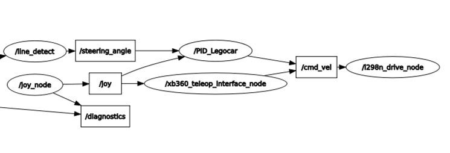

# **Line Detection**

The package provide a functional interface between the line detection package and the l298n driver. The `/steering_angle` message coming from the line detect model is used for direct control of the steering of the LegoCar, a PD controller ('I' contribution present but not used) has been used in order to adjust throttling while steering.

## **1 - Main dependencies**

* geometry_msgs/Twist
* sensor_msgs/Joy
* ros/ros
* line_detect/steering_angle

## **2 - Functionalities**

The package subscribe to the topic `/steering_angle` (type line_detect/steering_angle), published by the [line detect](../line_detect) package. Messages are published on topic `/cmd_vel` (type geometry_msgs/Twist).

Subscription to the `/joy` topic is required for having a enable button (in this case the **B** button of the xbox360 joystick) in order to switch on/off the following controller.

Key parameters are loaded from the configuration file [config.yaml](../config/config.yaml).

A message of type of type geometry_msgs/Twist is composed of the following parts:

#### **Steering**

`cmd_vel_msg.angular.z = -Ca*steering_angle.ang`

`steering_angle` come from the line_detect package. The steering command given is just a linear derivation of the msg steering_angle (Ca is a coefficient). 

#### **Throttling**

`cmd_vel_msg.linear.x = -def_vel - PID_module(steering_angle.ang)`

At a fixed speed, when the car steers the speed is reduced. For this reason throttling consists of two contributions: a fixed part (`def_vel`) + a variable part controlled by a PID controller and dependent on the steering_angle msg.

In this specific case a PD controller has been used since the 'I' contribution is not needed for a correct functionality of the car.

