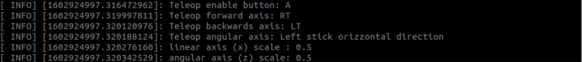

# **Xbox360 Controller Interface**

The package provide a functional interface for the control of the Legocar. Standard interfaces are also available for the xbox360 controller ([teleop twist joy](http://wiki.ros.org/teleop_twist_joy)), unfortunately I found them overcomplicated for the control of the car.

## **1 - Main dependencies**

* geometry_msgs/Twist
* sensor_msgs/Joy
* ros/ros

## **2 - Functionalities**

The package subscribe to the message `/joy` (type sensor_msgs/Joy), published by the [joy node](http://wiki.ros.org/joy). A message `/cmd_vel` (type geometry_msgs/Twist) is published.


The published message contains two main coordinates `cmd_vel.linear.x` that is going to be used for the throttling of the car and `cmd_vel.angular.z` for the steering.

The mapping of the bottons/axis can be modified in the header file [include/xb360_teleop_interface.h](include/xb360_teleop_interface.h): 

```` C++
int enable_button = 0;
int forward_axis = 5;
int backward_axis = 2;
int angular_axis = 0;
````

following the table below: 

| Button Index | Button name | Axis Index | Axis name    |
|--------------|---------------------------|------------|-----------------------------|
|  0           | A                         |  0         | Left/Right Axis stick left  |
|  1           | B                         |  1         | Up/Down Axis stick left     |
|  2           | X                         |  2         | LT                          |
|  3           | Y                         |  3         | Left/Right Axis stick right |
|  4           | LB                        |  4         | Up/Down Axis stick right    |
|  5           | RB                        |  5         | RT                          |
|  6           | back                      |  6         | cross key left/right        |
|  7           | start                     |  7         | cross key up/down           |
|  8           | power                     |            |                             |
|  9           | Button stick left         |            |                             |
|  10          | Button stick right        |            |                             |

When the node is run information about the controller buttons/axes are printed:

